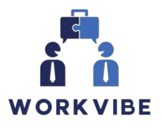
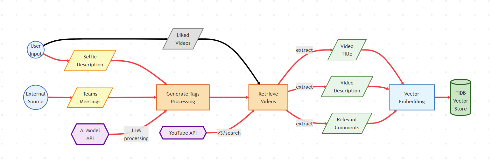
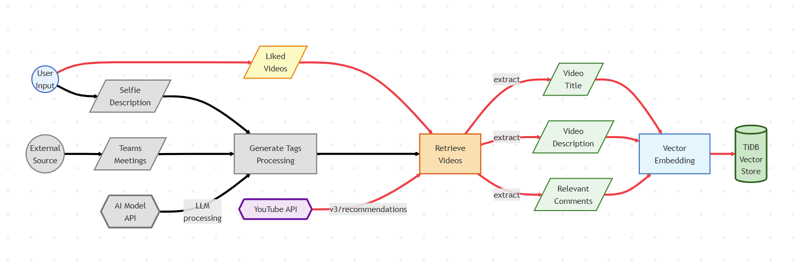
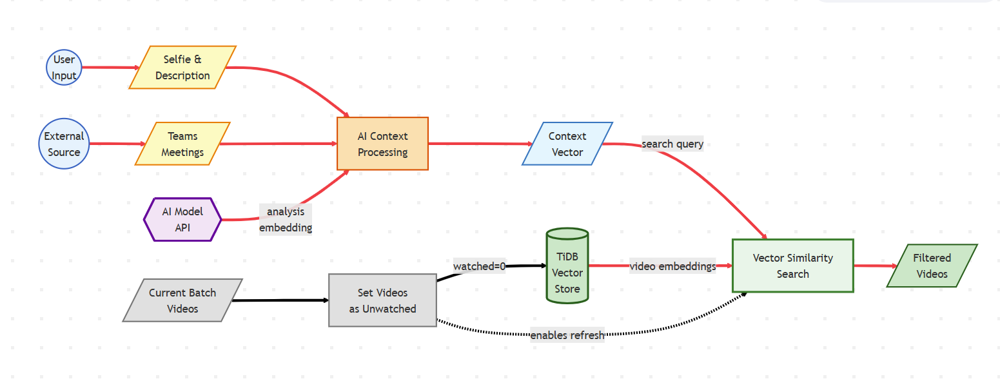
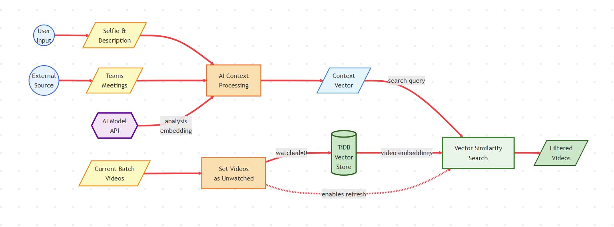
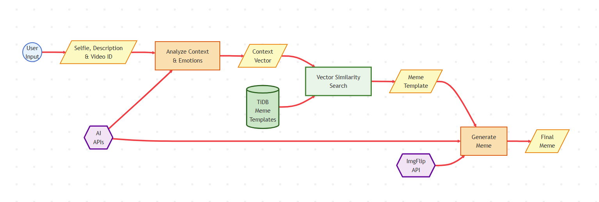
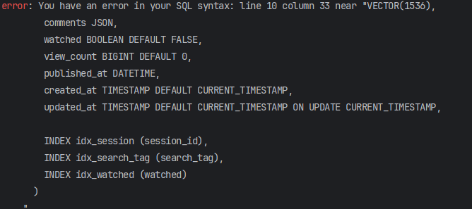

## Table of Contents
- [Project Overview](#project-overview)
- [Technical Architecture](#technical-architecture)
- [Features](#features)
- [Setup Instructions](#setup-instructions)
- [Running the Application](#running-the-application)
- [API Endpoints](#api-endpoints)
- [Social Impact](#social-impact)
- [Demo Video](#demo-video)

**Developer account connected to the TiDB Database:** eduard.jitareanu@stud.ubbcluj.ro  

## Project Overview

WorkVibe is a sophisticated AI-powered workplace engagement web application that creates personalized content experiences. By analyzing real-time emotional states, work schedules, and user preferences, it delivers contextually relevant video recommendations and generates custom memes to enhance workplace wellbeing and productivity.

The system orchestrates multiple AI services through a modular architecture, combining OpenAI GPT-4 for context understanding, AWS Rekognition for emotion detection, and TiDB Serverless for high-performance vector similarity search. This creates an intelligent content curation pipeline that adapts to each user's unique emotional and situational context.

### Key Capabilities
- **Multi-modal Context Analysis**: Integrates facial emotion recognition, natural language processing, and calendar data to build comprehensive user context profiles
- **Vector-Powered Intelligence**: Utilizes TiDB Serverless with 1536-dimensional embeddings
- **Intelligent Service Orchestration**: Coordinates multiple AI services and APIs in automated workflows for content ingestion, processing, and generation
- **Creative Content Generation**: Produces contextually appropriate memes using AI-driven template selection and text generation
- **Enterprise Integration**: Seamlessly connects with Microsoft Teams for calendar analysis and workplace context understanding

## Technical Architecture

### System Components
- **Frontend**: React.js with Vite build system for fast development and optimized production builds
- **Backend**: Node.js/Express API server with modular service architecture
- **Database**: TiDB Serverless with vector search capabilities (cosine similarity on 1536-dimensional embeddings)
- **AI Services**: OpenAI (GPT-4o-mini & text-embedding-3-small), AWS Rekognition, YouTube Data API v3, ImgFlip API
- **Authentication**: Microsoft Graph API with OAuth 2.0 for Teams integration
- **Security**: Helmet, CORS, rate limiting, input validation and sanitization

### Data Flow Architecture

#### 1. Video Ingestion Flow 



The ingestion pipeline implements a dual-path architecture for acquiring content:

**Path 1: AI-Generated Tags** (Context-Driven Discovery):
- **User Input** provides a selfie image and text description capturing current mood and needs
- **External Source** streams Microsoft Teams meeting data to understand work context
- Both inputs feed into **Generate Tags Processing**, which uses the **AI Model API** (OpenAI GPT-4) to:
  - Analyze emotional state from the selfie using AWS Rekognition
  - Understand situational and professional context from description and meeting schedule
  - Generate highly relevant YouTube search tags
- **Retrieve Videos** uses these tags to query the **YouTube API** `search` endpoint
- Returns videos matching the contextual tags

**Path 2: User Likes** (Preference-Based Expansion):
- **User Input** provides previously liked video IDs from their interaction history
- **Liked Videos** feed directly to **Retrieve Videos** component
- **YouTube API** `recommendations` endpoint analyzes liked videos to find similar content
- Discovers related videos that match user's demonstrated preferences

**Convergence & Processing**:
- Both paths merge at **Retrieve Videos**, creating a unified stream of content
- System extracts **Video Title**, **Description**, and **Comments** (top 5 most relevant comments)
- **Vector Embedding** process combines all text data and uses OpenAI's text-embedding-3-small model to create 1536-dimensional vectors
- **TiDB Vector Store** persists these embeddings with video metadata

#### 2. Video Filtering Flow


The filtering pipeline creates personalized recommendations by matching user context against the entire video database through sophisticated vector similarity search:

**Context Collection & Analysis**:
- **User Input** captures a real-time selfie and descriptive text about current feelings/needs
- **External Source** provides cached **Teams Meetings** data from Microsoft Graph API
- **AI Context Processing** orchestrates multiple AI services:
  - AWS Rekognition detects facial emotions (8 emotion types with confidence scores)
  - OpenAI GPT-4 synthesizes emotion data + text description + calendar context
  - Generates a comprehensive context description based on all these three
- **AI Model API** provides both the analysis capabilities and embedding generation

**Vector Search & Matching**:
- **Context Vector** is generated using OpenAI's embedding model (1536 dimensions)
- **Vector Similarity Search** queries the **TiDB Vector Store**
- **TiDB Vector Store** returns top 20 most relevant videos from the entire database
- **Filtered Videos** delivered to user with metadata including:
  - Video title, channel, view count
  - Similarity score (0.7-1.0 range)
  - Thumbnail and duration

#### 3. Refresh Flow

The refresh flow is the same as the Video Filtering Flow (see section 2) but with an additional reset step that marks previously watched videos as unwatched, expanding the available content pool.

The refresh mechanism enables continuous content discovery by intelligently resetting the video pool while preserving user context, preventing content fatigue and enabling infinite browsing:

**Phase 1 - Reset** (Content Pool Expansion):
- **Current Batch Videos** identifies the last 20 videos shown to the user
- **Set Videos as Unwatched** executes a batch update in the database:
  - Updates `watched = FALSE` for identified video IDs
- Updates propagate to **TiDB Vector Store**, instantly expanding the available video pool

**Phase 2 - Re-filtering**:
- Executes the same **Video Filtering Flow** (see section 2) using stored selfie/description and cached Teams meetings
- Returns different results because previously watched videos are now available again in the expanded pool
- Maintains the same personalized context while providing fresh content

The dotted line from **Set Videos as Unwatched** to **Vector Similarity Search** shows the sequential dependency.
#### 4. Meme Generation Flow


The meme generation pipeline creates contextually appropriate humor by combining emotional understanding, template matching, and AI-driven text generation to produce personalized memes:

**Sequential Processing Flow**:

1. **Input Collection & Context Analysis**: 
   - **User Input** provides three key elements:
     - Selfie image for current emotional state
     - Text description of mood/situation
     - Selected Video ID for content context
   - **Analyze Context & Emotions** processes these inputs:
     - Extracts video metadata (title, tags, channel theme)
     - Combines with stored emotion analysis from initial flow
     - Identifies workplace scenario from calendar context
   - **AI APIs** (OpenAI GPT-4) assist in understanding nuanced context and generating appropriate humor angles

2. **Intelligent Template Selection**:
   - **Context Vector** generated from the analyzed context (1536 dimensions)
   - **Vector Similarity Search** queries **TiDB Meme Templates** database containing:
     - 100 pre-analyzed popular meme formats
     - Each template stored with use-case embeddings
     - Templates categorized by emotion and scenario fit
   - Returns best matching **Meme Template** with metadata:
     - Template ID and image URL
     - Text box positions and count

3. **Dynamic Meme Generation**:
   - **Generate Meme** orchestrates the creative process:
     - **AI APIs** (GPT-4) generate contextual text:
       - Analyzes template format requirements
       - Creates workplace-appropriate humor
     - **ImgFlip API** handles image rendering:
       - Receives template ID and generated text
       - Generates 500x500px JPEG image
   - **Final Meme** that can be downloaded

##  Features

### Core Features

#### 1. **Emotion-Aware Video Recommendations**
- AWS Rekognition analyzes facial emotions from selfies
- Combines emotional state with text descriptions for context
- Vector similarity search matches content to user's current mood

#### 2. **Calendar-Integrated Context**
- Microsoft Teams integration fetches meeting data
- Analyzes work schedule to understand user's situational context
- Adjusts recommendations based on upcoming meetings or stress levels

#### 3. **Multi-Step Agent Workflows**
The system chains multiple operations in automated workflows:
- **Ingest → Index → Search → Generate → Display**
- Each step feeds into the next without manual intervention
- Demonstrates agentic behavior with decision-making capabilities

#### 4. **Vector-Powered Content Matching**
- All content (videos, memes) stored with high-dimensional vector embeddings
- TiDB's native vector functions enable fast similarity search
- Cosine similarity matching ensures relevant results

#### 5. **AI-Generated Contextual Memes**
- Analyzes user state and video context
- Searches 100+ meme templates using vector similarity
- GPT-4 generates personalized text for each meme box
- Creates shareable memes via ImgFlip API

##  Setup Instructions

### Prerequisites
- Node.js 18+ and npm
- TiDB Cloud account
- API keys for: OpenAI, AWS, YouTube, ImgFlip, Microsoft Graph

#### AWS Setup (for Emotion Detection)
1. Create an AWS account and set up IAM user with Rekognition permissions
2. Generate AWS Access Key ID and Secret Access Key

### Installation

1. **Clone the repository**
```bash
git clone https://github.com/Eduardismund/workvibe
cd workvibe
```

2. **Set up backend**
```bash
cd backend
npm install
cp .env.example .env
# Edit .env with your API keys and TiDB connection string
```

3. **Configure environment variables in .env**
```env
# TiDB Database
DB_HOST=your-tidb-host.prod.aws.tidbcloud.com
DB_PORT=4000
DB_USER=your-tidb-username
DB_PASSWORD=your-tidb-password
DB_NAME=your-database-name
DB_SSL=true

# AI Services
OPENAI_API_KEY=your_openai_key
OPENAI_MODEL=gpt-4o-mini
OPENAI_EMBEDDING_MODEL=text-embedding-3-small
AWS_ACCESS_KEY_ID=your_aws_key
AWS_SECRET_ACCESS_KEY=your_aws_secret
AWS_REGION=us-east-1

# APIs
YOUTUBE_API_KEY=your_youtube_key
IMGFLIP_USERNAME=your_imgflip_username
IMGFLIP_PASSWORD=your_imgflip_password

# Microsoft Teams
MICROSOFT_CLIENT_ID=your_client_id
MICROSOFT_CLIENT_SECRET=your_client_secret
MICROSOFT_TENANT_ID=your_tenant_id
MICROSOFT_REDIRECT_URI=http://localhost:3002/api/auth/callback
```

4. **Database setup**
```bash
# The app will connect to your existing TiDB database
# Ensure your TiDB instance has the required tables: teams_meetings, youtube_videos, meme_templates

# Note: Table creation SQL is currently commented out in src/config/database.js
# due to VECTOR(1536) syntax not being recognized by the Node.js TiDB driver
# Tables should be created manually in TiDB Cloud console or via direct SQL client
```


5. **Set up frontend**
```bash
cd ../frontend
npm install
```

## Running the Application

1. **Start backend server**
```bash
cd backend
npm run dev
# Server runs on http://localhost:3002
```

2. **Start frontend**
```bash
cd frontend
npm run dev
# App runs on http://localhost:5173
```

## API Endpoints

### Core Agent Workflows
- `POST /api/agent/ingest` - Main video ingestion workflow (multipart/form-data: selfie, description)
- `POST /api/agent/filter` - Filter videos based on context analysis (multipart/form-data: selfie, description)
- `POST /api/agent/ingest-liked-videos` - Ingest videos based on user likes

### Content Management
- `GET /api/ingest/content-stats` - Get database statistics (videos/memes count)
- `POST /api/ingest/reset-watched` - Reset watch history for refresh functionality

### Microsoft Teams Integration
- `GET /api/auth/login` - Initiate Microsoft OAuth2 login
- `GET /api/auth/callback` - OAuth callback (automatic)
- `GET /api/auth/logout` - Logout and clear session
- `GET /api/teams/today` - Get today's meetings for authenticated user

### Meme Generation
- `POST /api/memes/create` - Create personalized meme from user context (multipart/form-data: selfie)
- `POST /api/memes/ingest` - Ingest meme templates into database

### System Health
- `GET /api/health` - Service health check and system information
- `GET /api/docs` - Comprehensive API documentation


## Social Impact

WorkVibe directly addresses social needs in our modern workplace:

### Mental Health & Wellbeing
- **Mood Enhancement**: Delivers uplifting content when users are feeling down or overwhelmed
- **Emotional Awareness**: Helps users recognize and acknowledge their emotional states

### Work-Life Balance
- **Calendar-Aware Support**: Analyzes work schedules to understand stress patterns
- **Decompression Aid**: Provides personalized entertainment to help transition from work to personal time

### Workplace Community Building
- **Shared Humor**: Meme generation creates common ground for team bonding
- **Emotional Intelligence**: Promotes awareness of collective workplace mood


##  Demo Video

**[Watch the demo video, it's fun, trust me](https://www.youtube.com/watch?v=wuuxy-WGb8E)**

The demo showcases:
- All 5 workflows explained & in action
- A complete usage of the application from Microsoft Auth to Meme Generation
- Some funny skits to underline the issues my project is solving
